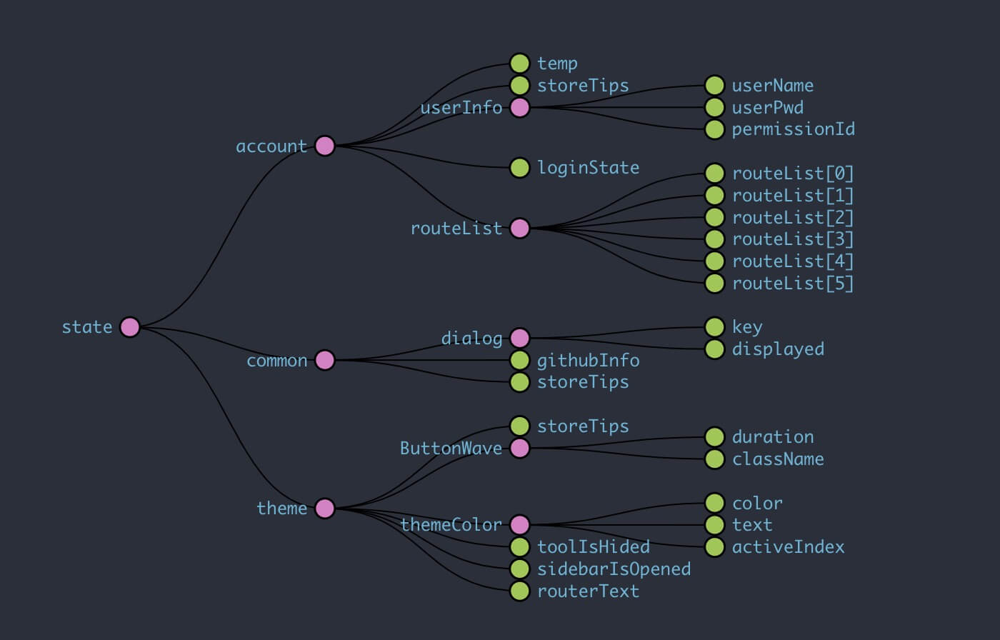

<h2 align="center">React+Material-ui构建的后台管理系统</h2>

<div align="center">

[](https://reactjs.org/)
[](https://redux.js.org/)
[](https://reacttraining.com/react-router/)
[](https://redux-actions.js.org/)
[](https://redux-saga.js.org/)
[](https://github.com/reduxjs/reselect)
[](https://github.com/mui-org/material-ui)
[](https://material-table.com/)
[](https://www.styled-components.com)
[](https://plopjs.com/)

</div>

> 一个基于React全家桶结合Material-ui的管理系统，使用redux管理全局state，redux-saga中间件处理异步数据，更好的融合state和action，redux-actions中间件简化了redux的复杂写法，使用reselect来精确获取指定的state，内置缓存效果，优化渲染压力。

#### 1、如何开发查看

``` bash
# 克隆该仓库
git clone git@github.com:SimpleRoom/walker-admin.git

# 进入walker-admin文件夹
cd walker-admin

# 安装依赖
npm install
# 或者
yarn add

# 启动项目：http://localhost:3800
npm run start
# 或者
yarn start

# 打包构建
npm run build
# 或者
yarn build

# 快速创建components和store
# 全局安装plop后
plop
# 未全局安装
npm run plop

# 注：CHANGELOG-安装使用(细化commit)
npm install -g commitizen
# 或者本地安装
npm install --save-dev commitizen

npm install -g cz-conventional-changelog
# 或者本地安装
npm install cz-conventional-changelog --save-dev

# 添加新的CHANGELOG
git add XX之后

# 进入可选择性的命令行界面：按照提示选择填写
git cz

# 自动生成对应的commit信息到：CHANGELOG.md文件内，方面追踪查看(复制命令行内变化到changelog)
npm run changelog

# 生成releases
npm run release -- --release-as 1.0.0


```

#### 2、目录模块


```shell

plop── 快速创建components和store的模板

     ┌── assets      资源文件
     ├── components  页面组件
     ├── router      路由配置
     ├── store       state模块管理中心
src──├── styles      页面样式
     ├
     ├── utils       插件和工具
     ├
     ├── views       与路由对应的页面
     └── index.js    页面配置入口
     
 
             ┌── Card             面板组件
             ├── CustomButtons    按钮组件
             ├── CustomInput      输入框组件
             ├── CustomTabs       公用Tab切换组件
components ──├── Dialog           弹框组件
             ├── Footer           底部footer
             ├── Grid             栅格组件
             ├── HeadNavBar       头部导航组件
             ├── HotelCard        酒店页面UI面板
             ├── HotelList        酒店页面列表UI组件
             ├── Login            登录组件
             ├── MaterialTable    定制可编辑Table组件
             ├── MuiDatepicker    日期选择器组件
             ├── MuiTimepicker    时间选择器组件
             ├── Notifications    自定义提示消息组件
             ├── Snackbar         Material-ui官方消息提示组件
             ├── Table            定制不可编辑的Table组件
             ├── Loading          loading组件
             ├── NotFound         404组件
             ├── ScrollToTopMount 路由切换缓动到顶部组件
             ├── SideBar          侧边栏路由导航
             └── SideTool         右边工具栏组件
             
             
       ┌── modules         不同的state模块
       ├     ├── account   登录验证state
       ├     ├── common    全局公用的state
       ├     └── theme     主题控制state
store──├
       └── indexStore.js   state入口
     
```

+ root-state-tree



#### 3、日志记录
+ [CHANGELOG](https://github.com/SimpleRoom/walker-admin/blob/master/CHANGELOG.md)

#### 4、在线查看
+ [在线预览](https://simpleroom.github.io/)
+ 账号：<code>admin</code>密码：<code>123456</code>

#### 5、工具概括

+ 1、 <code>redux</code>state管理容器
+ 2、 <code>react-redux</code>React官方控制React组件与Redux的连接容器
+ 3、 <code>redux-actions</code>简化Redux写法工具
+ 4、 <code>redux-saga</code>Redux处理异步数据的中间件
+ 5、 <code>reselect</code>Redux的选择器工具，精确获取指定state，减轻渲染压力
+ 6、<code>styled-components</code>可以使用es6来编写css的工具
+ 7、<code>npm run plop</code>自动生成组件或store到指定目录，配置：(plopfile.js&plop)

### License

[Simplified](https://github.com/SimpleRoom/walker-admin/blob/master/LICENSE)
